## 单因子模型预测APPL股票
因子:`"close"`
**学习30天进行预测**
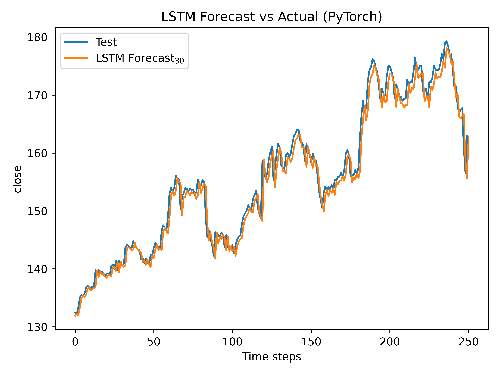
**学习60天进行预测**
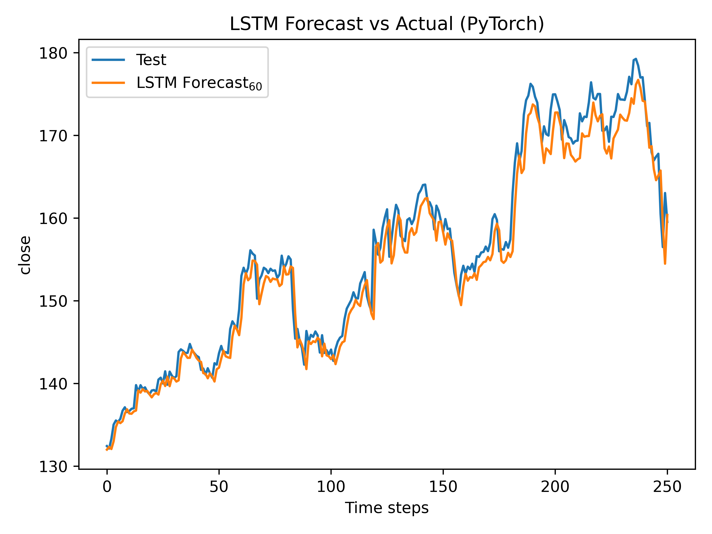
**学习90天进行预测**
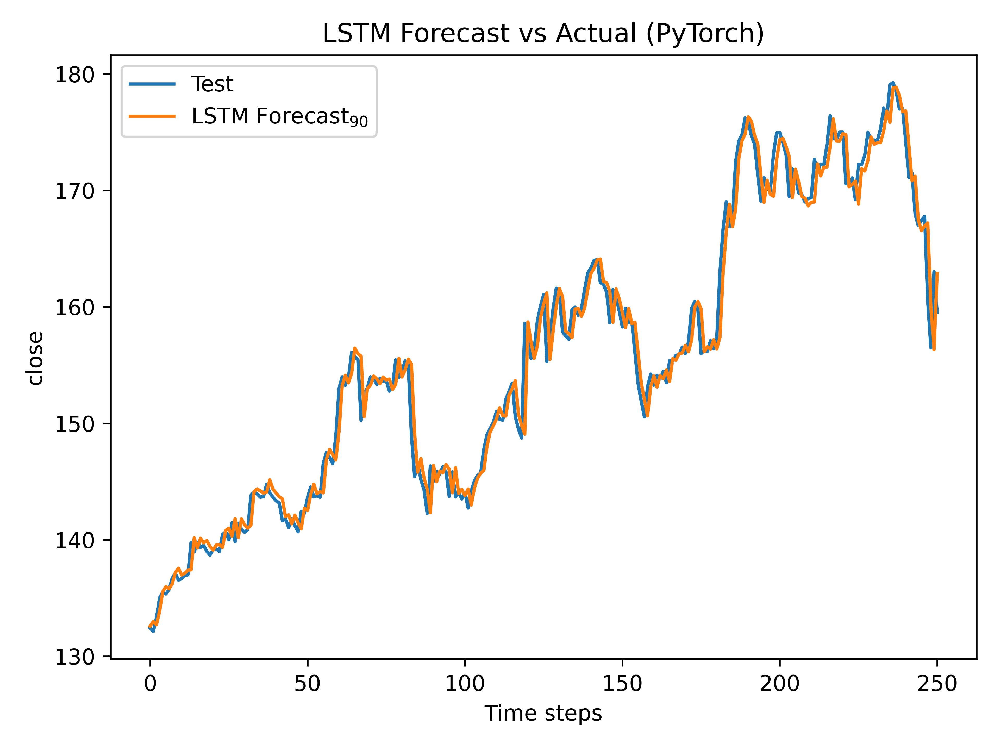
**三张图合并**
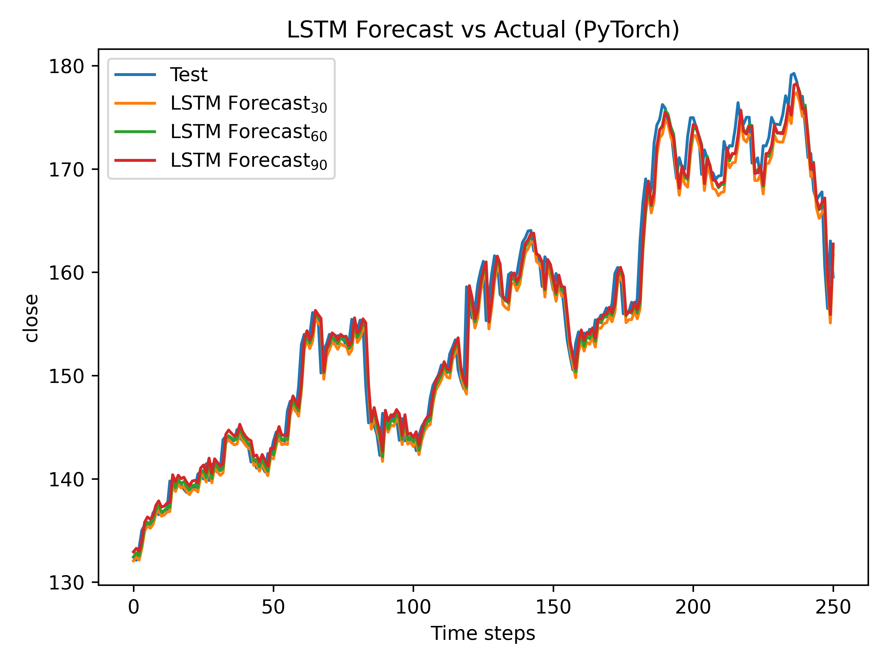
## 多因子模型基于APPL股票学习预测AAPL、AAL、ABBV
因子:`"open", "high", "low", "close", "volume"`
**学习30天**
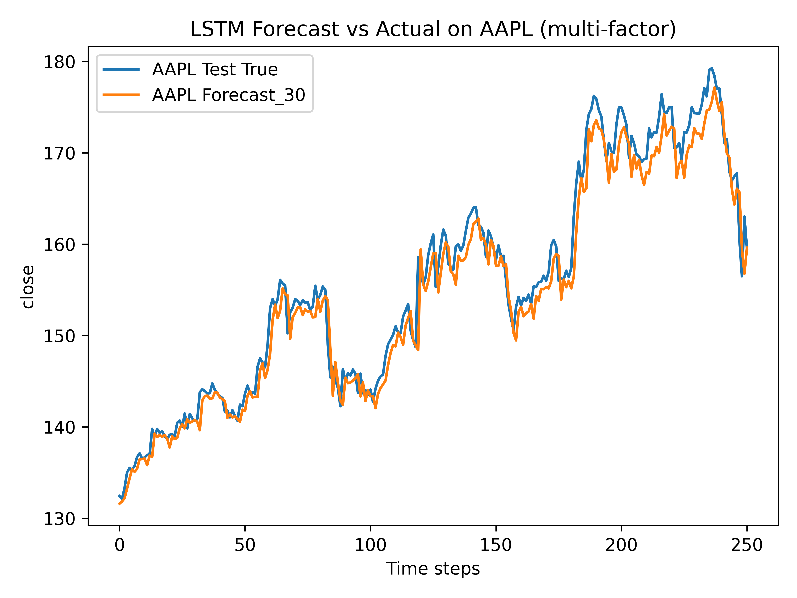
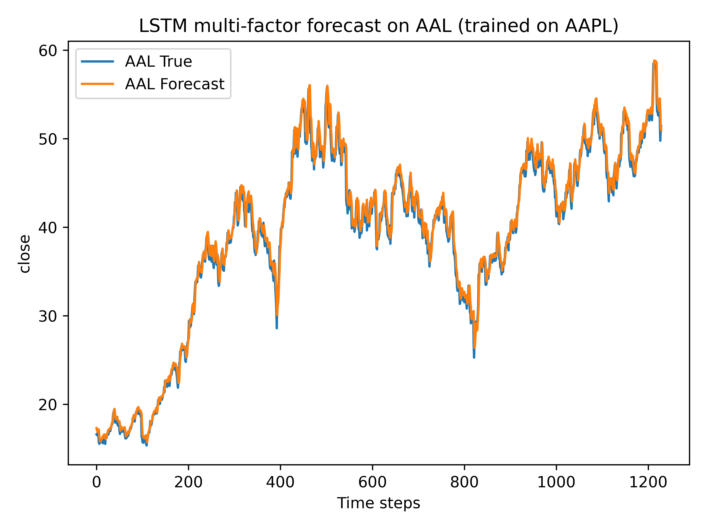
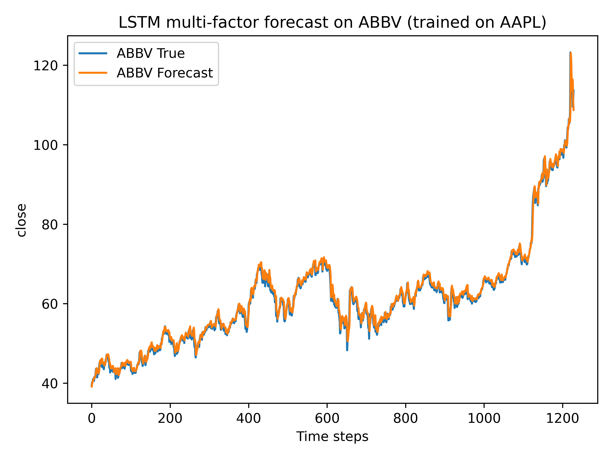
**学习60天**
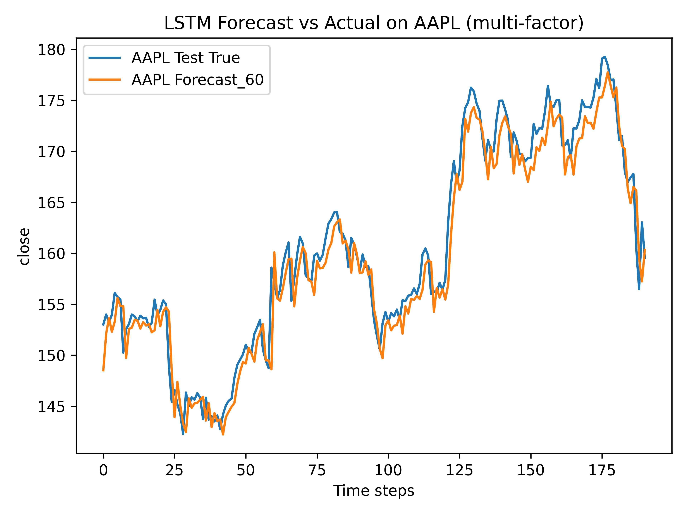
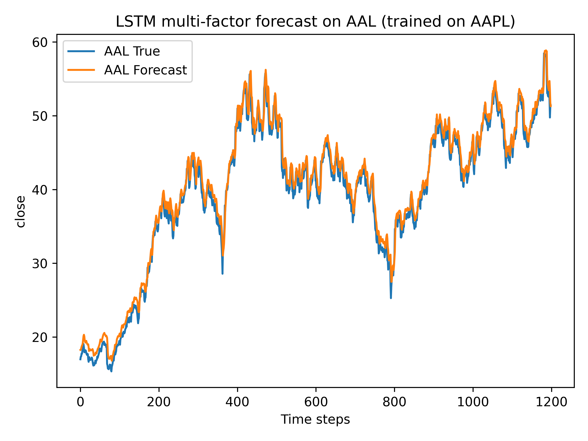
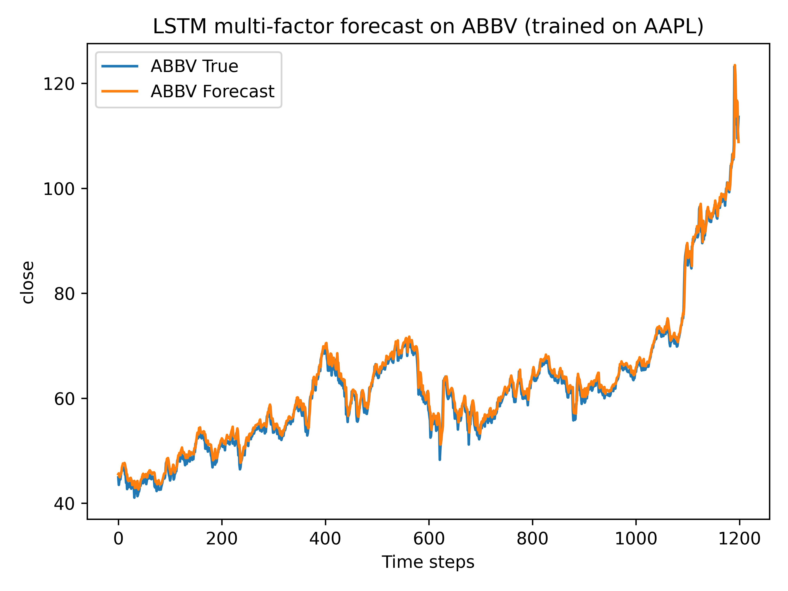
**学习90天**
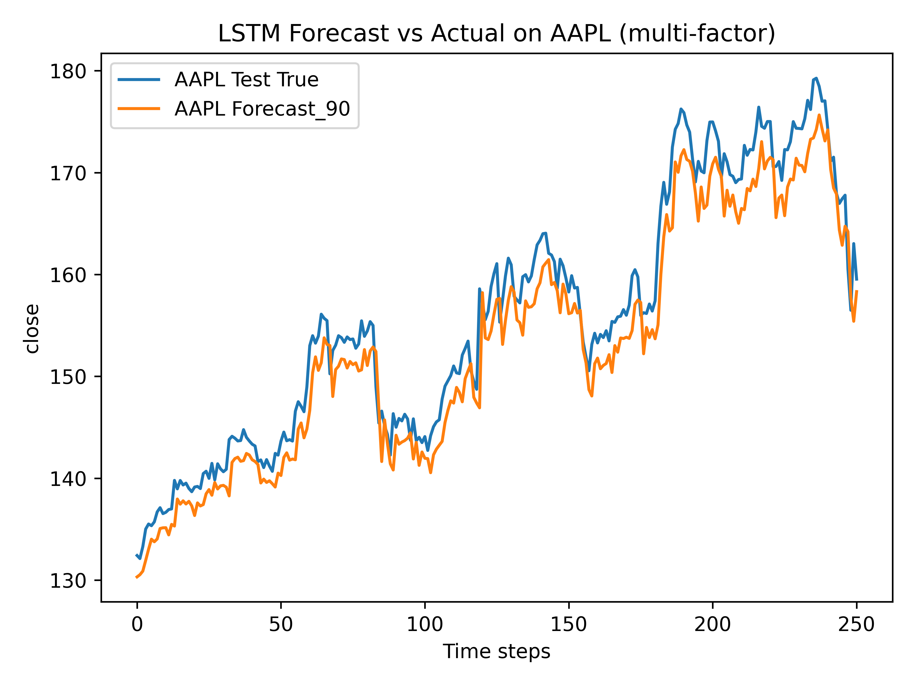
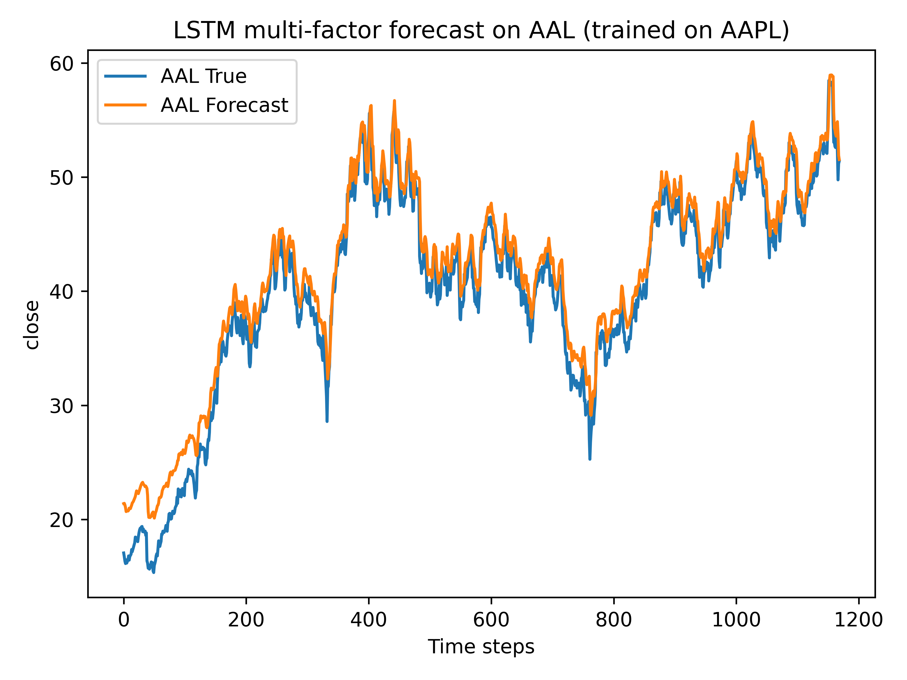
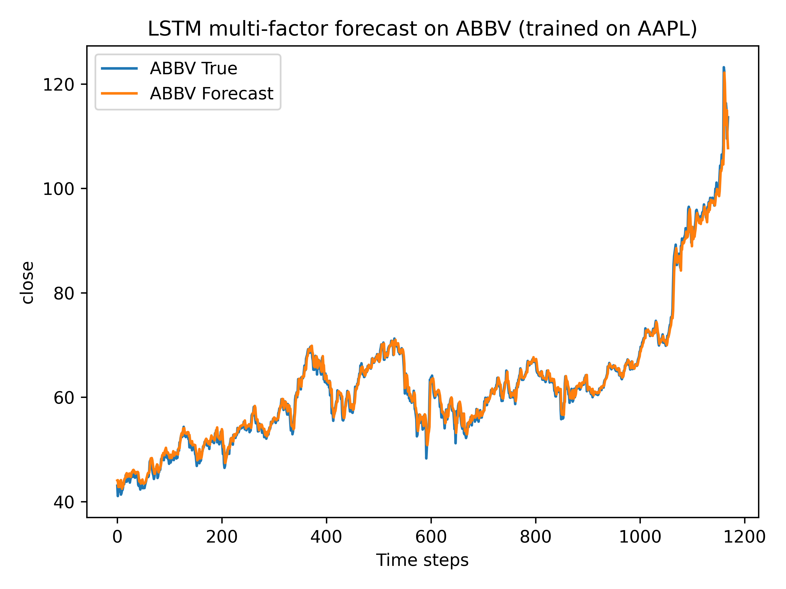

## 问题解答
1. 学习天数的作用是什么？
在您的代码中，学习天数（window）是指 LSTM 模型在做出预测时所考虑的过去数据的天数。具体来说，window 参数决定了模型会使用多少天的历史数据来预测未来的股票价格。例如，如果 window 设置为 30，模型将使用过去 30 天的股票数据来预测下一天的价格。   选择不同的 window 值（如 30，60，90 天）会对模型的预测性能产生影响，主要原因包括以下几点： 
数据量与模型复杂度：window 值越大，意味着 LSTM 模型会处理更长的序列，这可能会增加模型的复杂度，使其更好地捕捉长期趋势。然而，随着 window 值的增加，数据量也会减少，因为您需要足够的历史数据来构建训练样本。 
短期与长期趋势：window 值越小，模型更可能捕捉到短期市场波动和趋势；window 值越大，模型可能更关注长期市场动态和趋势。不同股票的数据特性不同，短期趋势和长期趋势的重要性也会有所不同。 
过拟合与欠拟合：window 值的选择还会影响模型的过拟合与欠拟合。如果 window 过小，模型可能无法从数据中学习到足够的信息，导致欠拟合。如果 window 过大，模型可能对训练数据中的噪音过度敏感，导致过拟合。 
数据粒度：不同的 window 值会影响数据的粒度。较大的 window 可能会平滑掉一些短期的噪声，使数据更加平滑，从而可能提高模型的预测性能。但这也可能错过一些重要的短期市场变化。 
因此，选择合适的 window 值需要根据具体的数据集和目标来进行实验和调整。通常情况下，可以通过交叉验证等方法来寻找最合适的参数组合。在您的代码中，通过输入不同的 window 值，您可以观察到模型在不同时间窗口下的表现，从而更好地理解模型的行为和数据的特性。

代码如下：
**单因子**
```python
# LSTM forecasting on AAPL_data.csv (PyTorch version)
import os
import numpy as np
import pandas as pd
import matplotlib.pyplot as plt
from pathlib import Path
from sklearn.preprocessing import MinMaxScaler
from sklearn.metrics import mean_absolute_error, mean_squared_error

import torch
import torch.nn as nn
from torch.utils.data import TensorDataset, DataLoader

device = torch.device("cuda" if torch.cuda.is_available() else "cpu")

DATA_PATH = Path(r"AAPL_data.csv")
OUT_DIR = Path("./outputs"); OUT_DIR.mkdir(parents=True, exist_ok=True)

def load_series(date_col="date", price_col="close"):
    df = pd.read_csv(DATA_PATH)
    df[date_col] = pd.to_datetime(df[date_col], errors="coerce")
    df = df.dropna(subset=[date_col]).sort_values(date_col)
    s = df.set_index(date_col)[price_col].astype(float)
    return s

def make_supervised(values, window, horizon=1):
    X, y = [], []
    for i in range(len(values) - window - horizon + 1):
        X.append(values[i:i+window])
        y.append(values[i+window:i+window+horizon])
    return np.array(X), np.array(y).reshape(-1, horizon)

def split_series(values, test_ratio=0.2, min_test=30):
    n = len(values)
    t = max(int(n*test_ratio), min_test)
    return values[:-t], values[-t:]

def metrics(y_true, y_pred):
    mae = mean_absolute_error(y_true, y_pred)
    rmse = np.sqrt(mean_squared_error(y_true, y_pred))
    mape = np.mean(np.abs((y_true - y_pred)/(y_true+1e-9)))*100
    return mae, rmse, mape

# ====== PyTorch LSTM 定义 ======
class LSTMPredictor(nn.Module):
    def __init__(self, input_size=1, hidden_size=64, horizon=1):
        super().__init__()
        self.lstm = nn.LSTM(
            input_size=input_size,
            hidden_size=hidden_size,
            batch_first=True  # (batch, seq_len, feat)
        )
        self.fc = nn.Linear(hidden_size, horizon)

    def forward(self, x):
        # x: (batch, seq_len, input_size)
        out, _ = self.lstm(x)
        # 取最后一个时间步
        last_hidden = out[:, -1, :]  # (batch, hidden_size)
        out = self.fc(last_hidden)   # (batch, horizon)
        return out

def lstm_torch(train_vals, test_vals, window, horizon=1,
               epochs=20, batch=32, units=64, dropout=0.0,Loss=[]):
    # dropout 参数暂不使用（可以在 LSTM/Linear 后加 nn.Dropout）
    scaler = MinMaxScaler()
    all_vals = np.concatenate([train_vals, test_vals])
    scaled = scaler.fit_transform(all_vals.reshape(-1,1)).flatten()
    train_scaled = scaled[:len(train_vals)]
    test_scaled = scaled[len(train_vals):]

    # 构造监督学习数据
    X_train, y_train = make_supervised(train_scaled, window, horizon)

    # 转成张量并放到 device
    X_train_t = torch.tensor(X_train, dtype=torch.float32).unsqueeze(-1).to(device)  # (N, window, 1)
    y_train_t = torch.tensor(y_train, dtype=torch.float32).to(device)               # (N, horizon)

    dataset = TensorDataset(X_train_t, y_train_t)
    loader = DataLoader(dataset, batch_size=batch, shuffle=True)

    # 模型、损失、优化器
    model = LSTMPredictor(input_size=1, hidden_size=units, horizon=horizon).to(device)
    criterion = nn.MSELoss()
    optimizer = torch.optim.Adam(model.parameters(), lr=1e-3)

    # 训练
    model.train()
    for ep in range(epochs):
        epoch_loss = 0.0
        for xb, yb in loader:
            optimizer.zero_grad()
            pred = model(xb)
            loss = criterion(pred, yb)
            loss.backward()
            optimizer.step()
            epoch_loss += loss.item() * xb.size(0)
        print(f"Epoch {ep+1}/{epochs} - loss: {epoch_loss/len(dataset):.6f}")
    Loss.append(loss)


    # 预测：自回归滚动预测，与原 TF 版本逻辑一致
    model.eval()
    history = list(train_scaled[-window:])
    preds = []
    with torch.no_grad():
        for t in range(len(test_scaled)):
            x = np.array(history[-window:]).reshape(1, window, 1)
            x_t = torch.tensor(x, dtype=torch.float32).to(device)
            yhat = model(x_t).cpu().numpy().flatten()  # horizon=1 -> 取 [0]
            preds.append(yhat[0])
            # 用真实 test_scaled[t] 继续往前滚
            history.append(test_scaled[t])

    preds = np.array(preds).reshape(-1,1)
    inv_preds = scaler.inverse_transform(preds).flatten()
    inv_test = scaler.inverse_transform(test_scaled.reshape(-1,1)).flatten()
    return inv_test, inv_preds

def main(m):
    s = load_series()
    train, test = split_series(s.values.astype(float), 0.2, 30)
    Loss = []

    for i in range(m):
        n = int(input("请输入学习天数"))
        y_true, y_pred = lstm_torch(train, test,
                                    window=n, horizon=1,
                                    epochs=200, batch=32,
                                    units=64, dropout=0.1,Loss=Loss)
        MAE, RMSE, MAPE = metrics(y_true, y_pred)
        print(f"LSTM (PyTorch) -> MAE={MAE:.4f} RMSE={RMSE:.4f} MAPE={MAPE:.2f}%")

        plt.figure()
        plt.plot(range(len(y_true)), y_true, label="Test")
        plt.plot(range(len(y_pred)), y_pred, label=f"LSTM Forecast$_{{{n}}}$")
        plt.title("LSTM Forecast vs Actual (PyTorch)")
        plt.xlabel("Time steps"); plt.ylabel("close")
        plt.legend(); plt.tight_layout()
        plt.savefig(OUT_DIR / f"lstm_forecast_torch_{i}.png", dpi=600)
        plt.close()
    
    print(Loss)

if __name__ == "__main__":
    main(3)
```
**多因子**
```python
import numpy as np
import pandas as pd
import matplotlib.pyplot as plt
from pathlib import Path
from sklearn.preprocessing import MinMaxScaler
from sklearn.metrics import mean_absolute_error, mean_squared_error

import torch
import torch.nn as nn
from torch.utils.data import TensorDataset, DataLoader

device = torch.device("cuda" if torch.cuda.is_available() else "cpu")

DATA_PATH = Path("stock.csv")      
OUT_DIR = Path("./outputs1"); OUT_DIR.mkdir(parents=True, exist_ok=True)

TRAIN_NAME = "AAPL"
OTHER_NAMES = ["AAL", "ABBV"]     

FEATURES = ["open", "high", "low", "close", "volume"]
TARGET = "close"

# ====== 数据加载与处理 ======
def load_all(date_col="date", name_col="Name"):
    df = pd.read_csv(DATA_PATH)
    df[date_col] = pd.to_datetime(df[date_col], errors="coerce")
    df = df.dropna(subset=[date_col]).sort_values([name_col, date_col])
    return df

def get_series_by_name(df, name, date_col="date", name_col="Name"):
    sub = df[df[name_col] == name].copy()
    if sub.empty:
        raise ValueError(f"在 CSV 中找不到股票: {name}")
    sub = sub.sort_values(date_col)
    return sub.set_index(date_col)

def split_series(values, test_ratio=0.2, min_test=30):
    n = len(values)
    t = max(int(n * test_ratio), min_test)
    return values[:-t], values[-t:]

def make_supervised_multi(X_feat, y_vals, window, horizon=1):
    """
    X_feat: (T, n_features)
    y_vals: (T,) 目标是一维 close
    """
    X_list, y_list = [], []
    T = len(y_vals)
    for i in range(T - window - horizon + 1):
        X_list.append(X_feat[i:i+window, :])
        y_list.append(y_vals[i+window:i+window+horizon])
    X = np.stack(X_list)                 # (N, window, n_features)
    y = np.array(y_list).reshape(-1, horizon)   # (N, horizon)
    return X, y

def metrics(y_true, y_pred):
    mae = mean_absolute_error(y_true, y_pred)
    rmse = np.sqrt(mean_squared_error(y_true, y_pred))
    mape = np.mean(np.abs((y_true - y_pred) / (y_true + 1e-9))) * 100
    return mae, rmse, mape

# ====== LSTM 模型 ======
class LSTMPredictor(nn.Module):
    def __init__(self, input_size, hidden_size=64, horizon=1):
        super().__init__()
        self.lstm = nn.LSTM(
            input_size=input_size,
            hidden_size=hidden_size,
            batch_first=True
        )
        self.fc = nn.Linear(hidden_size, horizon)

    def forward(self, x):
        # x: (batch, seq_len, input_size)
        out, _ = self.lstm(x)
        last_hidden = out[:, -1, :]     # (batch, hidden_size)
        out = self.fc(last_hidden)      # (batch, horizon)
        return out

# ====== 训练 + 在同一股票 test 上预测 ======
def lstm_torch_multi(
    X_train_feat, y_train_vals,
    X_test_feat, y_test_vals,
    window,
    horizon=1,
    epochs=200,
    batch=32,
    units=64,
    return_model=False
):
    """
    X_*_feat: (T, n_features)
    y_*_vals: (T,)
    """
    n_features = X_train_feat.shape[1]

    # 对全部数据做联合归一化
    all_feat = np.vstack([X_train_feat, X_test_feat])
    all_target = np.concatenate([y_train_vals, y_test_vals])

    scaler_X = MinMaxScaler()
    scaler_y = MinMaxScaler()

    all_feat_scaled = scaler_X.fit_transform(all_feat)
    all_target_scaled = scaler_y.fit_transform(all_target.reshape(-1, 1)).flatten()

    train_len = len(X_train_feat)
    X_train_scaled = all_feat_scaled[:train_len]
    X_test_scaled = all_feat_scaled[train_len:]
    y_train_scaled = all_target_scaled[:train_len]
    y_test_scaled = all_target_scaled[train_len:]

    # 构造监督学习数据
    X_train_seq, y_train_seq = make_supervised_multi(X_train_scaled, y_train_scaled, window, horizon)
    X_test_seq, y_test_seq = make_supervised_multi(X_test_scaled, y_test_scaled, window, horizon)

    X_train_t = torch.tensor(X_train_seq, dtype=torch.float32).to(device)
    y_train_t = torch.tensor(y_train_seq, dtype=torch.float32).to(device)

    dataset = TensorDataset(X_train_t, y_train_t)
    loader = DataLoader(dataset, batch_size=batch, shuffle=True)

    model = LSTMPredictor(input_size=n_features, hidden_size=units, horizon=horizon).to(device)
    criterion = nn.MSELoss()
    optimizer = torch.optim.Adam(model.parameters(), lr=1e-3)

    model.train()
    for ep in range(epochs):
        epoch_loss = 0.0
        for xb, yb in loader:
            optimizer.zero_grad()
            pred = model(xb)
            loss = criterion(pred, yb)
            loss.backward()
            optimizer.step()
            epoch_loss += loss.item() * xb.size(0)
        print(f"Epoch {ep+1}/{epochs} - loss: {epoch_loss/len(dataset):.6f}")

    # 在 test 段滚动预测（仍然用真实特征 X_test_scaled 做输入）
    model.eval()
    preds_scaled = []
    with torch.no_grad():
        for i in range(len(X_test_seq)):
            x = torch.tensor(X_test_seq[i:i+1], dtype=torch.float32).to(device)
            yhat_scaled = model(x).cpu().numpy().flatten()[0]
            preds_scaled.append(yhat_scaled)

    preds_scaled = np.array(preds_scaled).reshape(-1, 1)
    y_test_target = y_test_seq[:, 0]                      # 只看 horizon=1 的目标

    inv_preds = scaler_y.inverse_transform(preds_scaled).flatten()
    inv_test = scaler_y.inverse_transform(y_test_target.reshape(-1,1)).flatten()

    if return_model:
        return inv_test, inv_preds, model, scaler_X, scaler_y
    else:
        return inv_test, inv_preds

# ====== 用训练好的模型在其它股票上预测 ======
def forecast_other_stock_multi(model, scaler_X, scaler_y, df_stock, window, horizon=1):
    """
    df_stock: 某一只股票的数据，index 为 date，包含 FEATURES 和 TARGET
    """
    feat = df_stock[FEATURES].values.astype(float)
    target = df_stock[TARGET].values.astype(float)

    feat_scaled = scaler_X.transform(feat)
    target_scaled = scaler_y.transform(target.reshape(-1,1)).flatten()

    X_seq, y_seq = make_supervised_multi(feat_scaled, target_scaled, window, horizon)
    X_t = torch.tensor(X_seq, dtype=torch.float32).to(device)

    model.eval()
    preds_scaled = []
    with torch.no_grad():
        for i in range(len(X_seq)):
            yhat = model(X_t[i:i+1]).cpu().numpy().flatten()[0]
            preds_scaled.append(yhat)

    preds_scaled = np.array(preds_scaled).reshape(-1,1)
    y_true_scaled = y_seq[:,0]

    inv_preds = scaler_y.inverse_transform(preds_scaled).flatten()
    inv_true = scaler_y.inverse_transform(y_true_scaled.reshape(-1,1)).flatten()
    return inv_true, inv_preds

def main(m):
    df_all = load_all()
    # 训练股票
    df_train_stock = get_series_by_name(df_all, TRAIN_NAME)
    if len(df_train_stock) < 100:
        raise ValueError(f"{TRAIN_NAME} 数据太少")

    # 特征与目标
    feat_vals = df_train_stock[FEATURES].values.astype(float)
    target_vals = df_train_stock[TARGET].values.astype(float)

    # 只按时间切 train/test
    n = len(target_vals)
    t = max(int(n * 0.2), 30)
    X_train_feat = feat_vals[:-t]
    X_test_feat  = feat_vals[-t:]
    y_train_vals = target_vals[:-t]
    y_test_vals  = target_vals[-t:]

    plt.figure()
    first_model = None
    first_scaler_X = None
    first_scaler_y = None
    first_window = None

    for i in range(m):
        n_window = int(input("请输入学习天数 window: "))

        if i == 0:
            y_true, y_pred, model, scaler_X, scaler_y = lstm_torch_multi(
                X_train_feat, y_train_vals,
                X_test_feat, y_test_vals,
                window=n_window,
                horizon=1,
                epochs=200,
                batch=32,
                units=64,
                return_model=True
            )
            first_model = model
            first_scaler_X = scaler_X
            first_scaler_y = scaler_y
            first_window = n_window
            plt.plot(range(len(y_true)), y_true, label=f"{TRAIN_NAME} Test True")
        else:
            y_true, y_pred = lstm_torch_multi(
                X_train_feat, y_train_vals,
                X_test_feat, y_test_vals,
                window=n_window,
                horizon=1,
                epochs=200,
                batch=32,
                units=64,
                return_model=False
            )

        MAE, RMSE, MAPE = metrics(y_true, y_pred)
        print(f"{TRAIN_NAME} LSTM (multi-factor, window={n_window}) -> "
              f"MAE={MAE:.4f} RMSE={RMSE:.4f} MAPE={MAPE:.2f}%")

        plt.plot(range(len(y_pred)), y_pred, label=f"{TRAIN_NAME} Forecast_{n_window}")

    plt.title(f"LSTM Forecast vs Actual on {TRAIN_NAME} (multi-factor)")
    plt.xlabel("Time steps"); plt.ylabel("close")
    plt.legend(); plt.tight_layout()
    plt.savefig(OUT_DIR / f"lstm_multi_{TRAIN_NAME}_{n_window}.png", dpi=600)

    # 用第一次训练的模型在其它股票上预测
    if first_model is not None and OTHER_NAMES:
        for name in OTHER_NAMES:
            try:
                df_other = get_series_by_name(df_all, name)
            except ValueError as e:
                print(e)
                continue

            if len(df_other) <= first_window + 5:
                print(f"{name} 数据太少，跳过。")
                continue

            y_true_o, y_pred_o = forecast_other_stock_multi(
                first_model, first_scaler_X, first_scaler_y,
                df_other, window=first_window, horizon=1
            )
            MAE_o, RMSE_o, MAPE_o = metrics(y_true_o, y_pred_o)
            print(f"{name} (multi-factor, use {TRAIN_NAME}-trained model) -> "
                  f"MAE={MAE_o:.4f} RMSE={RMSE_o:.4f} MAPE={MAPE_o:.2f}%")

            plt.figure()
            plt.plot(range(len(y_true_o)), y_true_o, label=f"{name} True")
            plt.plot(range(len(y_pred_o)), y_pred_o, label=f"{name} Forecast")
            plt.title(f"LSTM multi-factor forecast on {name} (trained on {TRAIN_NAME})")
            plt.xlabel("Time steps"); plt.ylabel("close")
            plt.legend(); plt.tight_layout()
            plt.savefig(OUT_DIR / f"lstm_multi_{name}_{n_window}.png", dpi=600)

if __name__ == "__main__":
    main(1)
```